# Python Program Obfuscator

[us English](README.md) | **cn 中文**

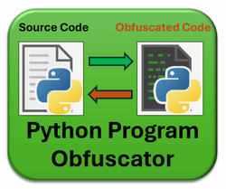

**程序设计目的**：该项目的主要目标是开发一个多平台 Python 程序混淆工具，该工具可以轻松保护那些希望保护其知识产权或管理其软件敏感算法的人的源代码。该工具将无缝地将源代码混淆和编码为不可读但 Python 解释器可执行的字节数据，这些数据可以与普通 python 程序混合执行。此外，它将提供一个解码器，将混淆的字节数据恢复为其原始源代码。该程序包含三个主要组件：

- **混淆编码器**：此组件加密 Python 源代码，无论是整个文件还是特定部分，使其以字节数据的形式不可读，然后嵌入执行标头以创建可执行但不可读的 python 程序/部分。
- **混淆解码器**：解码器旨在反转编码过程，此解码器将混淆的字节数据转换回其原始 Python 代码，从而确保易于读取和访问。
- **服务 Web 界面**：为用户提供用户友好的 Web 界面，以便轻松编码和解码 Python 程序。

程序混淆工具的使用示例如下所示，用户可以使用编码器将单行代码 `print("hello world")` 混淆为不可读的代码字节，然后使用解码器将其转换回来：

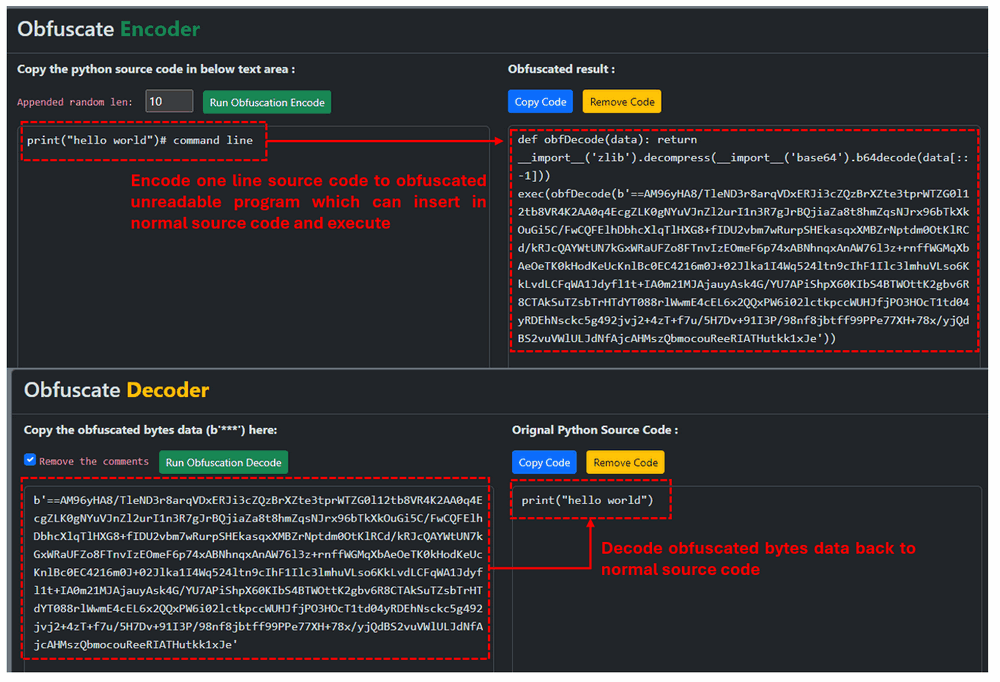

```
Figure 00: Code obfuscation encode and decode example, version v_0.1.3 (2025)
```

我们还提供 Python-API，供用户将编码和实时解码和执行功能集成到他们的程序中。视频展示详细用法：[link](https://youtu.be/2vG-mqkGg_4?si=keG-J5XppWxbxhtY)

```python
# Author:      Yuancheng Liu
# Created:     2024/03/21
# Version:     v_0.1.3
# Copyright:   Copyright (c) 2024 LiuYuancheng
# License:     MIT License
```

**Table of Contents**

[TOC]

------

### 1.項目简介

程序混淆是增强 Python 应用程序安全性的一种广泛采用的常见技术。市场上有各种混淆库和工具，例如 [pyarm](https://pyarmor.readthedocs.io/en/latest/) 或 [free online tool's obfuscation tool](https://freecodingtools.org/py-obfuscator)。混淆过程将采用诸如 `identifier renaming`、`code encryption`、`code packing`、`dead code insertion` 等方法，它可以有效地使黑客难以理解程序执行/控制流程，并保护敏感源代码免受未经授权的访问。但是，当前大多数混淆工具不提供诸如 `decoding algorithms`、`customization of obfuscation result size` 或 `selection of whether obfuscate entire/part of file` 等功能。

受此 [free online tool's obfuscation tool](https://freecodingtools.org/py-obfuscator) 概念的启发，我们的目标是开发一个基于 Web 的 Python 程序混淆工具，具有以下关键功能：

- 提供具有可自定义的编码混淆代码大小配置的多层 Python 代码混淆。
- 提供编码器和解码器功能，以方便混淆代码的维护和调试。
- 提供混淆整个 Python 程序或源代码的特定部分的功能，以增加灵活性。
- 集成灵活的代码随机化技术，以确保即使从同一源代码派生，每个生成的混淆代码都是唯一的。
- 提供一个标准化的 API，供用户无缝地将该工具集成到他们的项目中，并提供一个用户友好的 Web UI，以方便编码和解码操作。

混淆工具的工作流程如下所示：

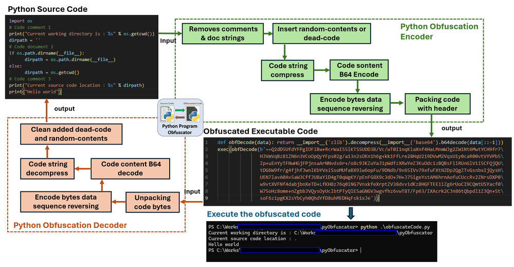

```
Figure 01: Code obfuscation encode and decode work flow, version v_0.1.3 (2025)
```

##### 1.1 混淆编码器 Web UI

混淆编码器页面如下所示。要混淆 Python 函数或程序，只需将 Python 源代码粘贴到源代码文本字段中，然后选择随机内容追加配置参数 `randomLen`（范围从 0 到 100）。在执行混淆编码过程之前，每行源代码将附加 `randomLen` * 16 Bytes 随机字符串。

混淆编码器网页视图 ： 

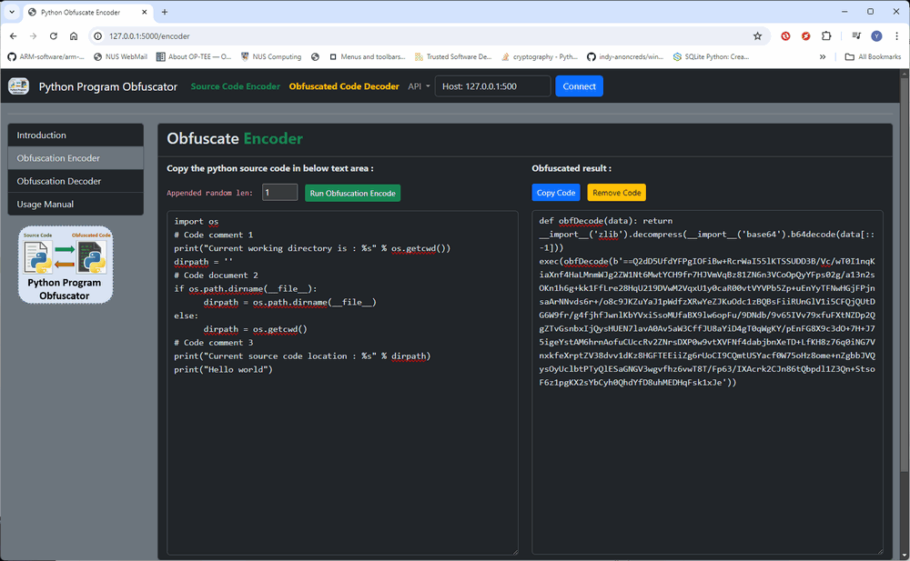

```
Figure 02: Code obfuscation webApp encoder screen shot, version v_0.1.3 (2025)
```

按下“运行混淆编码”按钮后，混淆的代码将显示在右侧的结果文本字段中。按复制代码按钮，然后将混淆的代码粘贴到您的程序中以执行。

注意：每次用户按下运行按钮时，都会生成不同的混淆代码结果。

##### 1.1 混淆解码器 Web UI

与编码器页面类似，解码器页面显示如下。用户需要将混淆代码的字节数据（包含在 `exec()` 函数中）复制到左侧的文本字段中。然后，通过单击“运行解码器”按钮，混淆的代码将转换回其原始源代码。

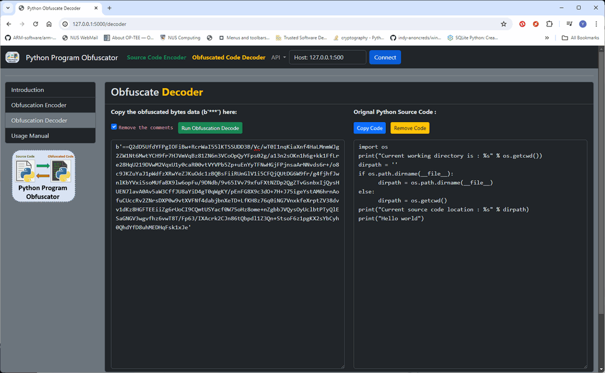

```
Figure 03: Code obfuscation webApp decoder screen shot, version v_0.1.3 (2025)
```

注意：如果用户希望获取没有注释的源代码，他们可以选中“删除注释”复选框。


------

### 2. 背景知识

**什么是程序混淆？**

程序混淆是软件开发中使用的一种技术，用于故意使程序的源代码更难以理解或反向工程，同时保持其功能。它通常用于开发人员希望保护其知识产权、防止未经授权的访问或阻止篡改软件的尝试的场景中。

以下是程序混淆中使用的一些常见技术：

1. **重命名标识符**：这涉及将代码中的变量、函数、类和其他标识符重命名为非描述性或隐秘的名称。例如，像 `userInput` 这样的变量可能会重命名为 `a` 或 `b`，从而更难以理解其目的。
2. **控制流混淆**：此技术涉及更改程序中的控制流，使其更难以遵循逻辑结构。这可以通过诸如添加冗余代码、以不寻常的方式使用条件语句或重构循环等技术来实现。
3. **数据混淆**：数据混淆涉及伪装程序中的数据，使其更难以理解或提取敏感信息。这可以包括加密字符串或将其拆分为在运行时连接的较小部分。
4. **代码加密**：这涉及加密程序中的部分或全部代码，并在运行时对其进行解密。这使得攻击者很难在不知道解密密钥的情况下分析代码。
5. **插入死代码**：将死代码（从未执行的代码）插入到程序中会使逆向工程师感到困惑，并使其更难以理解程序的真实功能。
6. **代码打包**：这涉及压缩或打包可执行文件，使其更难以使用标准工具进行分析。打包的代码通常在运行时解压缩和执行。
7. **反调试技术**：这些是用于检测和阻止程序被调试的方法，这会使攻击者更难以分析代码。

重要的是要注意，虽然混淆可以使反向工程更加困难，但它不是保护软件的万无一失的方法。熟练的攻击者仍然可以在给定足够的时间和资源的情况下对混淆的代码进行反向工程。因此，混淆通常与其他安全措施（如加密、访问控制和代码签名）结合使用。此外，混淆的代码可能更难以维护和调试，因此开发人员应在应用混淆技术之前权衡收益与潜在的缺点。


------

### 3. 项目设计

本节结合背景知识来阐明混淆过程中应用的步骤和技术。

##### 3.1 编码和解码的设计

如引言中提供的程序工作流程图所示，Python 源代码部分通过一系列步骤进行编码，以将 Python 源代码字符串转换为字节数据。随后，它被封装在一个解码头中。要执行字节数据，使用解码头将字节转换回字符串，然后将其传递到 Python 动态代码执行函数 `exec()` 以进行代码执行。编码步骤概述如下：

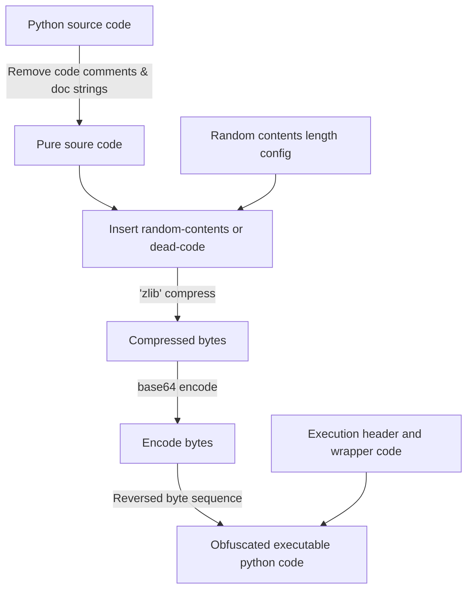

示例编码器源代码输入：

```python
import os
# Code comment 1
print("Current working directory is : %s" % os.getcwd())
dirpath = ''
# Code document 2
if os.path.dirname(__file__):
      dirpath = os.path.dirname(__file__)
else:
      dirpath = os.getcwd()
# Code comment 3
print("Current source code location : %s" % dirpath)
print("Hello world")
```

示例编码器混淆代码输出：

```python
def obfDecode(data): return __import__('zlib').decompress(__import__('base64').b64decode(data[::-1]))
exec(obfDecode(b'kDMA2910OfmOY0xz1Jeq1cjF1JMlFPYhZCtLm5r5V0c3LyNFMwBmnV7YF3hnto2YOMsfrKkvLSzKTp1tL3je1dP+R8t2mH74DVtheP0G1EUMVMnsRP3APWbRcAfFkilrWTbnlp3ttZVjhXcluBz5GOMb/UlK2UKJRzbbUXHe7DKL65v/y/trHOP3hfqE83kkRwle1v6OSgbVVAT7CZvvXGXWa6u6wBXjGgHPV02VULPoNfXFUXRCUxN11+ZFIxbON+t67wffylf9V3/xKJxHbe96nWPH/3aBwKW0e9GFl5DlK4zJUCSNqnhxlGpiCVNIKCHTC2uuOvPgUNLjQXiOJWJbRbEnW/YfrDQrsX9eUPX+tT4w6hx10UIIG2U7zcC2maRyDUhYcjeEeMOVjqHUR/aZTjtcVuOJ0GjIzrjqdau0yCup99y2Hov6/TZyKf/JPXmd1M+6IMyrPBpVuw8uBVYW72TRSDh1o1F2OuFvl05d1HhzjFYOuiuSqq+58tbop9aXeMV/lzj02klznW10GVcXSYESwFoLEcLoStyQaVw72AYC9UNEqEhvYgvGJizlmu1QsDmIhOcq1M3ViI2UV9/6Hrf55PtrZWqMfX0CF3YFPWI20OQmE4FjWKTHwduZ+wMzweDKqrBNbhWwj6GL6srBRXvVZvVAiyV+WNUAs8n3u/uPlbv7u/Ok6/4vU9jPP+1Dyme57KhvsRITjAGw1AakCa8M+oVb7C7IZ0pRFn8xyVdXmJRlRwoduC6hR/cuwBZUHCjScdDhB4I0G81XqP+/PIvAGmFho19mLzJCyZ94+m1k7trz3/QUzBQ0h0oJhbaeEOhzrBm15OrFoXuiATAG3TpdTH0Jqud75vO/97ffXQsSeG7Az9GP55p5moVcW4AZxQt+3pDQtfJeYVwSU3kh6jJNyuApFffdvFQdytMKCJGO9OLnjnWf+fPe3uvPzFO852U+Vnu58HP/pX+8P3+6nT/tukz8xX+x2X/2zH123+6pV7O/4Lf7Ln+492o77mrhGcdXegy4lyiNQJnIiRrIqRx9Vf+eJTdEbR0B1yoxwskbtt7SYIWLoujaBPnJYb+oGzH+5/wDvmN5rd68rP9g1gmsgROkfKzZgg/k0ZjoPgwZmWzkwtXgZCngFcnu1eKchFyUMpbHjJgR3QGnL6IKemRn6JX/+4Lf2X/yhXe0ff0RK9Hc5urkwNBs3d02Jz4ZmO9Mmw5roHzbmIvsZUSVKlKGejtxGfYeNcfhMcEXK2Ml1xJe'))
```

混淆编码过程中使用的混淆技术：

1. **字节反转**：结果数据字节数组被反转，以使反转的代码乍一看更难理解，并且需要在正确解释之前将其反转。
2. **随机化**：编码函数在混淆之前向每行添加指定长度的随机字符串。这为混淆的代码增加了进一步的复杂性和随机性。
3. **动态导入**：混淆的代码使用 `__import__()` 动态导入模块（`zlib` 和 `base64`）。此技术隐藏了导入，使其不太明显正在使用哪些模块。
4. **字符串操作**：编码过程从代码中删除注释、静态字符串和空行，以使代码更难以理解和分析。
5. **编码和压缩**：编码函数通过使用 base64 对代码进行编码并使用 `zlib` 对其进行压缩来混淆代码。此外，它还会反转结果字符串。此过程使代码在其编码形式中不可读。
6. **通过 `exec()` 执行**：代码由 `exec()` 函数执行。这种执行方法使得在不分析其执行的情况下难以理解代码的行为。

这些混淆技术使代码难以理解、分析和反向工程，从而增强了其对反向工程和未经授权的访问的抵抗力。

解码过程通过以下步骤反转编码过程:

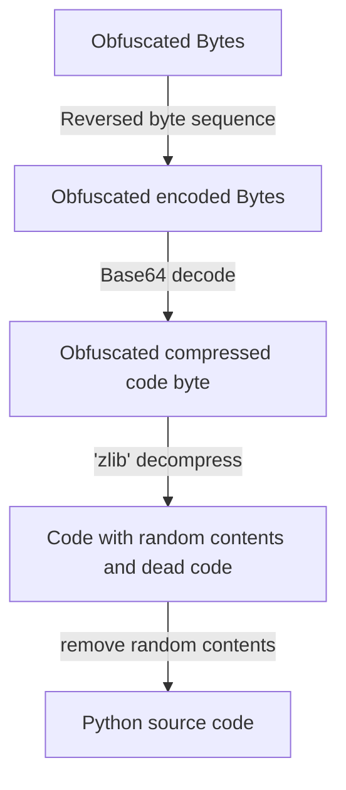

示例解码器混淆字节输入：

```python
b'==Azg/E+Hk/eC9JOcaYt02SskKCJHfYu6ZVAPyhHdaUjsOse30tA1QP7d3nvW7U4eWbcNtHxmP4jG6VKRiMCbBNe1/8UHBxw7WSMdLdeA6vnz07MBSDeOxNd91GOps8hieqUrq+9QO8BIrlwh1me8uwTqOvK7qNLgbc/bAsiysVCPPfoDwOxAE+YpjwxPvGPaBCdTP2QWyRuO36o4GRlaf8NtENhd5Uzcz6VcBntUaz73kkqyNxjXKCvrqFH2Cy5pc12ydzjuIS2p2ERKLy1IA0LZdHllai3el3/e4VY40KhjXeZkjmtgMmJxAyQ4wDgWPWqXiNfywoHb2OWVBA442CkfaqknK/aDE4exCL2PGERtupfoaVAgikXMR/ZdA2NkxKhO19JWowZYU0I8GSzd7mwOI6S+6C8r4ZwVAj12P+t5OUnvkVvx1lxRGXFxyh8FaFglYml1iilkUBzBrsTI24q2VgoCr5bA1nvSNdY8hbXvZBRS05i9YWwlQGzbgB15Qlcnh6Wb0aYxUVMrT58MYXngucLlVZVvACQdIr2YTFBjwlN5aslybv/Pf/zeML/+4zvjs9x1v+P+97fe8rP+9867fe++3v++fuO6uloQpnGAp9n2CEh7cmhi43pvoPpZK5ThFO7GeeRQETHqtkk1xJe'
```

示例解码器源代码输出：

```python
print("hello world")
```


------

### 4. 程序设置

在运行程序之前，请按照以下配置步骤操作。

##### 4.1 开发环境

- python 3.8.2rc2+ [Windows11]

##### 4.2 需要的其他库/软件

- Flask: https://flask.palletsprojects.com/en/3.0.x/ ，安装 `pip install Flask`
- Flask-SocketIO: https://flask-socketio.readthedocs.io/en/latest/ ，安装 `pip install Flask-SocketIO`

##### 4.3 需要的硬件：无

##### 4.4 程序文件列表

| 程序文件               | 执行环境     | 描述                                 |
| :--------------------- | :----------- | :----------------------------------- |
| src/pyObfuscator.py    | python 3.7 + | 提供混淆编码和解码功能的主要库模块。 |
| src/pyObfuscatorApp.py | python 3.7 + | 混淆 Web 界面。                      |
| templates/*.html       |              | 所有网页 html 文件。                 |


------

### 5. 程序用法/执行

我们为用户提供两个界面来使用该程序：控制台命令界面和 Web 界面。

#### 5.1 通过命令界面运行混淆器

**步骤 1**：通过命令运行程序：

```
python pyObfuscator.py
```

**步骤 2**：选择模式 0，然后按照步骤输入需要混淆的 python 程序，混淆的代码将保存在文件 `obfuscateCode.py` 中，然后用户可以更改文件名并替换原始文件。

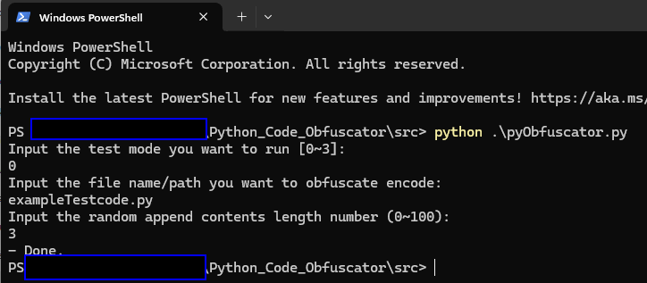

```
Figure 03: obfuscator test case usage screen shot, version v_0.1.3 (2025)
```

#### 5.2 通过 Web 界面运行混淆器

**步骤 1**：通过命令运行 Web 主机程序：

```
python pyObfuscatorApp.py
```

**步骤 2**：打开浏览器，在 URL 中键入：http://127.0.0.1:5000/

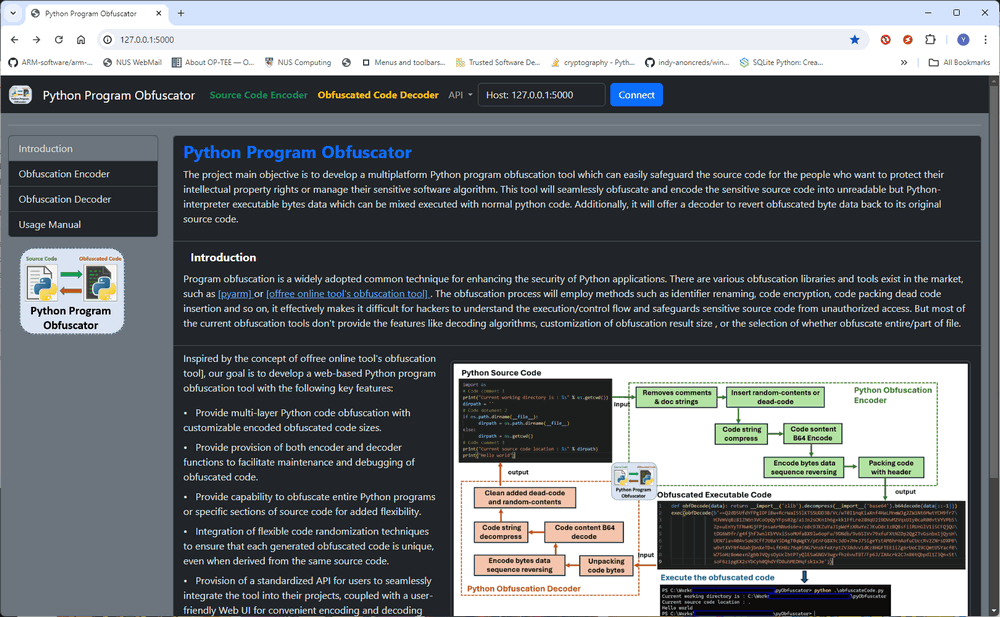

```
Figure 04: Code obfuscation webApp introduction page screen shot, version v_0.1.3 (2025)
```

**步骤 3**：选择 `Obfuscation Encoder从左侧导航菜单中选择Encoder，然后按照以下步骤对源代码进行混淆处理：`

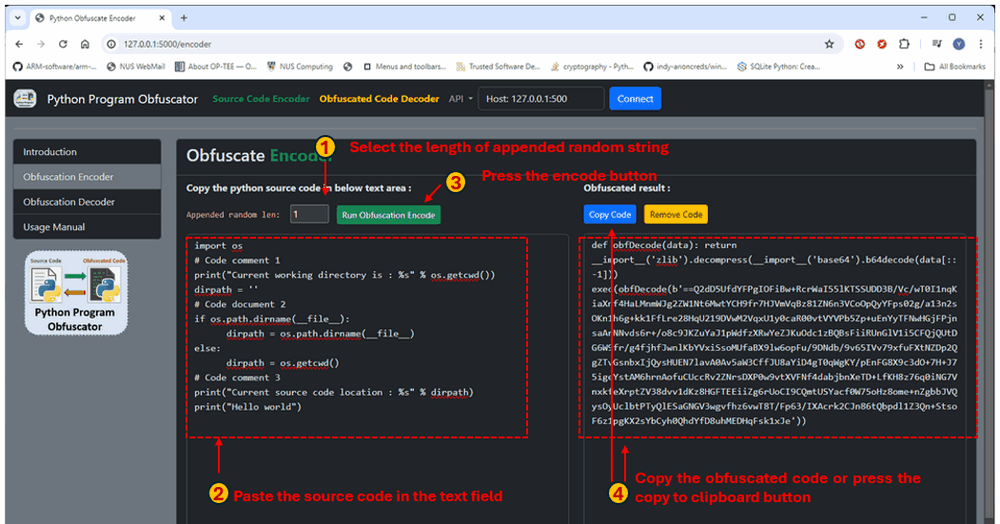

```
Figure 05: Code obfuscation webApp encoder usage steps, version v_0.1.3 (2025)
```

**Step4**: 从左侧导航菜单中选择`Obfuscation decoder`，然后按照以下步骤获取源代码：

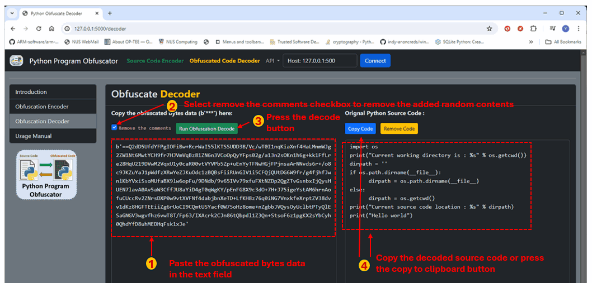

```
igure 05: Code obfuscation webApp decoder usage steps, version v_0.1.3 (2025)
```


------

### 6. 参考文獻

- **Pyarmor** : https://pyarmor.readthedocs.io/en/latest/
- **Free online tool's obfuscation tool**: https://freecodingtools.org/py-obfuscator

------

要在本地设置 Python Obfuscation，请参阅[Project GitHub Repo link](https://github.com/LiuYuancheng/Py-Code-Obfuscator)中的“Program Setup”部分

许可证类型：

```
MIT License 
```

感谢您花时间查看文章详情，如果您有任何问题和建议或发现任何程序错误，请随时给我留言。如果您能提出一些意见并分享任何改进建议，我们将不胜感激，以便我们能够把工作做得更好~

------

**上次编辑者：LiuYuancheng (liu_yuan_cheng@hotmail.com)，于 20/02/2026，如果您有任何问题，请随时给我留言。**